# cc-Q

Custom firmware for the **Coldcard Q**. It takes the Bitcoin workflow out of the
way and puts a daily-use personal terminal behind the device PIN instead: a
password vault, sign-in codes, and an encrypted journal.

The hardware is the reason. A Coldcard Q is a secure element, a real keyboard, a
screen, a camera, NFC, and no radio of any kind — a good body for secrets that
should never touch a network. cc-Q keeps the security model and replaces the
application.

Built on [Coldcard/firmware](https://github.com/Coldcard/firmware), **Q1 target
only**. Not affiliated with, endorsed by, or supported by Coinkite.

<a href="https://github.com/Ak1ra00/cc-Q/raw/main/releases/cc-Q/cc-Q-0.1-2026-09-14-q1-devkey0.dfu">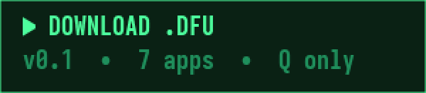</a>

**[Download `cc-Q-0.1-2026-09-14-q1-devkey0.dfu`](https://github.com/Ak1ra00/cc-Q/raw/main/releases/cc-Q/cc-Q-0.1-2026-09-14-q1-devkey0.dfu)** ·
sha256 `d25ef07d00df0258…4af827` ·
[browse it](releases/cc-Q/cc-Q-0.1-2026-09-14-q1-devkey0.dfu) ·
[older builds](releases/cc-Q)

The current build, with all seven apps in it. Q only. Check it before you flash
it — `cd releases/cc-Q && sha256sum -c SHA256SUMS`.

Two things to know before you flash it, both explained below: **your Q will warn
you about it on every boot** and keep the genuine light red, because Coinkite did
not sign it and cannot; and **it has never been run on a real Q** — the code is
tested and runs under the device's own MicroPython, but no screen has been drawn
on hardware yet. Use a device you are willing to wipe.

## What it looks like

<table>
<tr>
<td width="50%">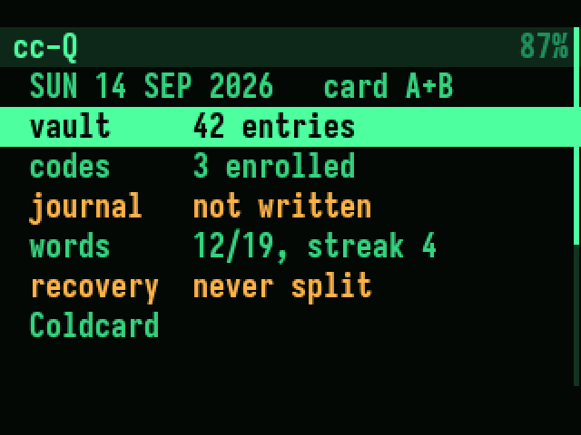</td>
<td width="50%">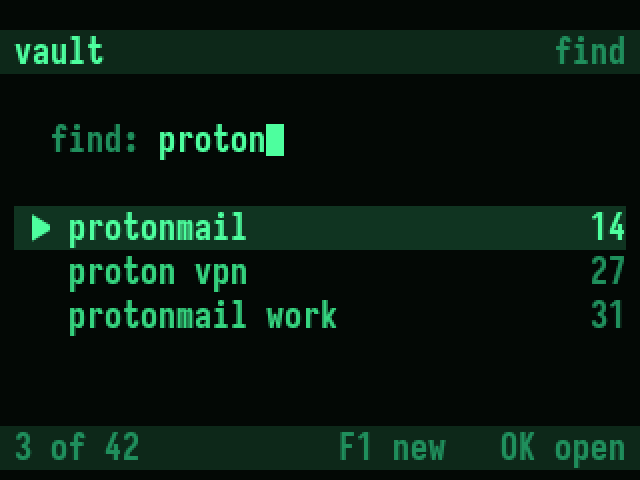</td>
</tr>
<tr>
<td><sub><b>The landing screen.</b> One row per app carrying its own status, the date on top, the Coldcard's own menu at the bottom. <code>not written</code> in amber is the only nag in the product.</sub></td>
<td><sub><b>Vault.</b> Opens straight here — typing is the fastest path to a password. The number on the right is the entry's id: assigned once, never reused.</sub></td>
</tr>
<tr>
<td>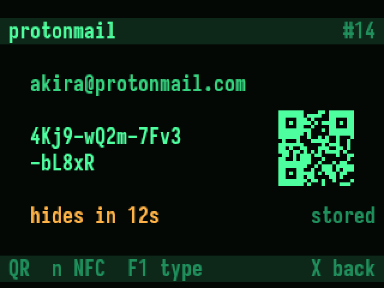</td>
<td>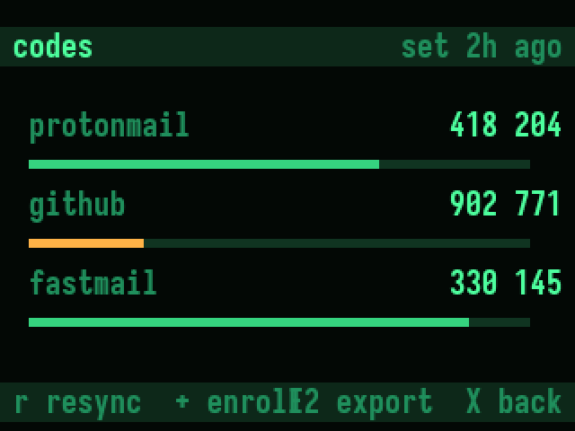</td>
</tr>
<tr>
<td><sub><b>Vault — entry.</b> Password large enough to read across a desk, QR beside it, 20-second auto-hide in amber.</sub></td>
<td><sub><b>Codes.</b> Three at once with countdown bars. The header always says how long ago the clock was set.</sub></td>
</tr>
<tr>
<td>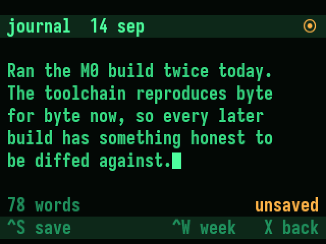</td>
<td>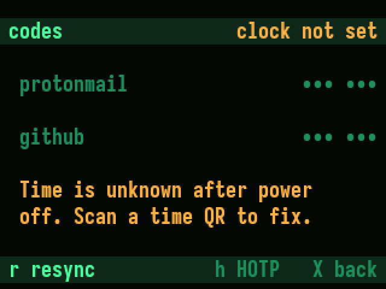</td>
</tr>
<tr>
<td><sub><b>Journal.</b> Five lines visible, on the Q's own keyboard. Save state is shown twice, because unsaved text on an unpluggable device deserves it.</sub></td>
<td><sub><b>Codes, clock unknown.</b> The Q has no clock. Rather than show numbers that might be wrong, cc-Q greys them and says why.</sub></td>
</tr>
<tr>
<td>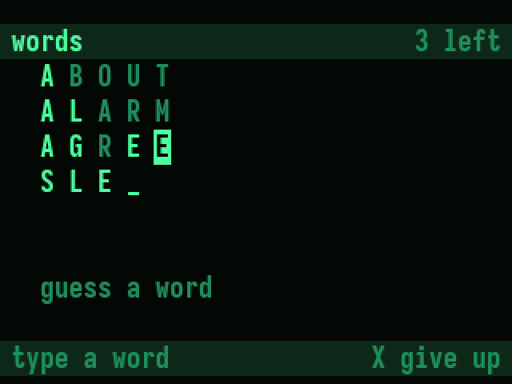</td>
<td>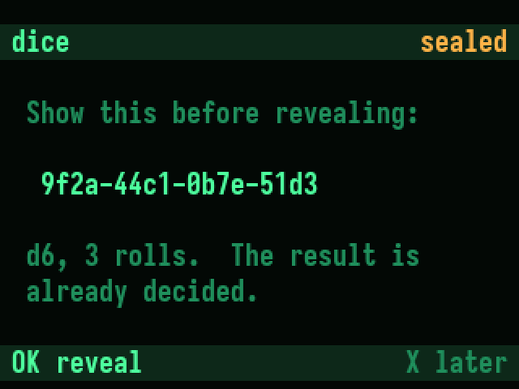</td>
</tr>
<tr>
<td><sub><b>words.</b> Six tries, on the BIP-39 list already in flash. Reverse video is an exact letter, bright is present, dim is not in the word — the three palettes the hardware has.</sub></td>
<td><sub><b>dice.</b> The code is shown <i>before</i> the roll is revealed, so afterwards anyone can check the result was fixed in advance.</sub></td>
</tr>
</table>

These are rendered from the Q's own font data at the panel's real geometry —
320×240, a 34×10 character grid of 9×22px cells — so the line lengths are the
line lengths you get, and the letter colouring in the game is what the scoring
code actually produces. The landing screen is upstream's own menu widget, drawn
here the way the firmware draws menus. What is still unproven is how any of it
behaves under a finger on a real device. Regenerate the images with
`python3 misc/dq-screens/render.py`.

## Read this first

> - **Your Q will not trust this firmware, and it is right not to.** Coldcard's
>   bootloader only trusts firmware signed by Coinkite, and nobody outside
>   Coinkite can do that. cc-Q is signed with the *developer* key instead — a
>   key whose private half is published in the source, so anyone can sign
>   anything with it. The signature therefore proves nothing about who built
>   this. Your Q says so, every boot, for about five seconds, and the *genuine*
>   light stays **red** until official Coinkite firmware is reinstalled:
>
>   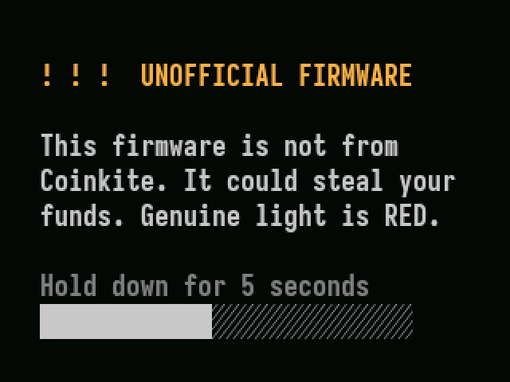
>
>   That screen comes from code cc-Q never touches. It cannot be themed or
>   skipped. It is the honest price of unofficial firmware.
> - **Keep an official Coinkite `.dfu` for your Q on a spare microSD**, from
>   [coldcard.com/downloads](https://coldcard.com/downloads). That card is the way
>   back. Set it aside before you flash anything from here.
> - Treat any device you flash as a **testing device**.
> - Q only. The image refuses to install on Mk3, Mk4, or Mk5 (`hw_compat 0x10`).

## What it is

Nine apps. After your PIN you land on a list of them, each row carrying its own
status — whether today's journal entry is written, whether the clock is set — and
the Coldcard's own menu is the last row. The ones that store anything are
encrypted under keys that never leave the device:

- **vault** `v` — passwords, searchable by service and login. Each entry has a
  number that never changes and never gets reused. That number is what you write
  on a paper card; the card itself carries no passwords.
- **codes** `c` — TOTP and HOTP sign-in codes, enrolled by scanning the QR the
  service shows you.
- **journal** `j` — one encrypted entry per day, written on the device's own
  keyboard.
- **recovery** `b` — split the device key into shares so a wiped or lost Q is
  survivable. Every share is needed; each one alone reveals nothing.
- **sign** `s` — sign and verify text with an identity key derived from the
  device key, no seed and no Bitcoin involved. Signatures are recoverable, so a
  verifier needs only the message and the signature.
- **witness** `w` — hash a file off the card and log the digest with the date you
  confirmed, so you can later prove the bytes are unchanged.
- **words** `g` — guess the five-letter word in six tries, played on the BIP-39
  wordlist that is already in the firmware. 555 words, no extra flash, and the
  ones you learn to recognise are the ones on your paper backup.
- **dice** `d` — rolls from the hardware TRNG, with a commitment: the Q shows a
  hash of the result *before* revealing it, so afterwards anyone can check the
  number was fixed in advance. Settle a bet without anyone being trusted.
- **keypad** `k` — snippets you retype constantly, typed into the machine in
  front of you over USB. It cannot reach the vault's passwords; typing is a
  service any app can use, and the vault uses it too. Note the Q's emulated
  keyboard only knows 42 characters — letters, digits, space and `* + - /` — so
  anything with `@` or `!` in it is refused rather than typed wrong.

Behind them: a green-phosphor CRT theme applied globally, a plugin registry so the
home screen never hardcodes an app list, and an app-scoped record store on microSD
with a schema version and atomic writes.

### No seed required

cc-Q runs fully **without a BIP39 seed**, and that is the supported default. On
first run it generates a 32-byte device key from the hardware TRNG and keeps it in
the settings blob, which is already encrypted under a key tied to your PIN and the
secure element. Each app gets its own subkey derived from that.

A seed is optional and changes exactly one thing: the vault can additionally offer
passwords derived from `(seed, index)` via BIP-85, which need no stored ciphertext.
Journal, codes, and the store itself never use it.

**The consequence, stated plainly: if the device is wiped, seedless data is gone
unless you exported it.** Derived vault entries survive a wipe as long as the seed
and the index list survive. Stored entries, journal, and codes do not. cc-Q says so
on first run rather than burying it here:

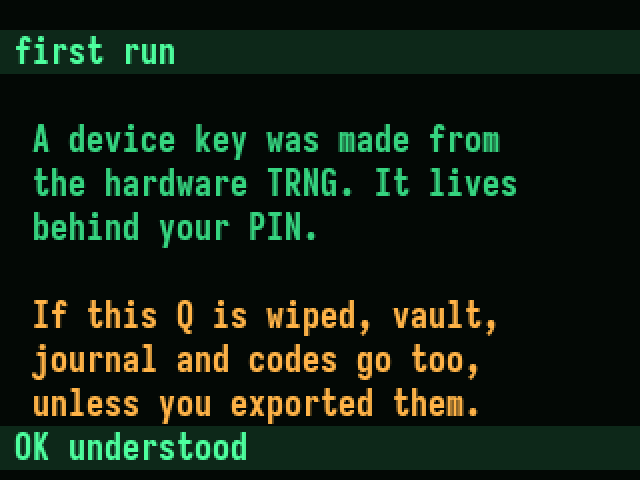

## Where this is up to

All seven apps are written, and cc-Q is what you land on after entering your PIN
— the Coldcard's own menu is the last row, with everything still in it. **None of
these screens has been drawn on a real Q yet**, so treat this as a working draft,
not a finished product.

What that means concretely:

| | |
|---|---|
| **Tested** | 160 tests: the encrypted store, key derivation, sign-in codes against the RFC vectors, share splitting, word scoring, dice commitments, and every app's record logic. |
| **Run for real** | The modules execute under the device's own MicroPython with its real AES, HMAC, secp256k1 and TRNG — not stand-ins. That caught two bugs CPython could not see. |
| **Not yet done** | Nobody has pressed a key on a Q running this. The screens are unproven. |
| **Next** | Running it. The simulator builds; nothing has been driven through it yet. |

The Q has no clock — no RTC, no backup cell, no 32.768 kHz crystal — so the date
is unknown at every boot. That is why the journal asks you what day it is and why
sign-in codes fall back to HOTP. The evidence is in [`SPEC.md`](SPEC.md).

The plan and its milestones live in [`SPEC.md`](SPEC.md), the backlog in
[`FEATURES.md`](FEATURES.md), and the rules the code is held to in
[`CLAUDE.md`](CLAUDE.md).

## Builds

| file | what is in it | sha256 |
|---|---|---|
| [`cc-Q-0.1-2026-09-14-q1-devkey0.dfu`](releases/cc-Q/cc-Q-0.1-2026-09-14-q1-devkey0.dfu) | **current.** All seven apps, on upstream 1.5.2Q. | `d25ef07d00df0258…4af827` |
| [`2026-09-03T1540-v1.5.2Q-q1-devkey0-cc-Q.dfu`](releases/cc-Q/2026-09-03T1540-v1.5.2Q-q1-devkey0-cc-Q.dfu) | Upstream 1.5.2Q rebuilt, unchanged. The toolchain proof, kept so later builds can be diffed against it. | `86868b47…7a3d61` |

Both are for the Q only and both are signed with the published developer key, so
both show the unofficial-firmware warning on every boot and keep the genuine
light red. Neither is signed by Coinkite and neither ever can be — Coinkite's
signing keys are theirs alone. `devkey0` in the filenames is that developer key:
key number 0 in the bootloader's list, the one whose private half ships in the
source at `stm32/keys/00.pem`.

`SHA256SUMS` in `releases/cc-Q/` covers both. It is not PGP-signed: it ties the
bytes to this repository and claims nothing more. Upstream's
`releases/signatures.txt` covers Coinkite's official binaries only and says
nothing about these files.

### Flashing, when you decide to

Flashing is a deliberate step you take, not part of any build routine — the
simulator is where cc-Q gets exercised. When you do want it on hardware: copy the
`.dfu` to a FAT32 microSD, then on the Q go **Advanced/Tools → Upgrade Firmware →
From MicroSD**, check the version on screen, and approve. The Q reboots and
installs.

To go back: install the matching official `.dfu` from
[coldcard.com/downloads](https://coldcard.com/downloads) the same way. Coldcard
refuses downgrades below the installed version's timestamp, so use that version or
newer. The genuine light goes green again on the next PIN entry.
[`docs/upgrade-recovery.md`](docs/upgrade-recovery.md) covers an interrupted
upgrade.

## Running it

The simulator is the primary target. Everything must run clean there first, and
you do not need a Q to work on cc-Q.

```shell
git clone --recursive https://github.com/Ak1ra00/cc-Q.git
cd cc-Q
python3 -m venv ENV && source ENV/bin/activate
pip install -U pip setuptools && pip install -r requirements.txt

cd unix && make setup && make ngu-setup && make && ./simulator.py --q1
```

Needs SDL2. Per-platform package lists for macOS and Linux are in
[`docs/upstream-README.md`](docs/upstream-README.md).

### Building the firmware

Built with the Arm GNU Toolchain 13.3.rel1 (`arm-none-eabi-gcc`) and Python 3.11:

```shell
pip install --editable cli            # provides `signit`, used by the Makefiles
cd stm32
make -f Q1-Makefile setup
make -f Q1-Makefile CFLAGS_EXTRA=-Wno-error=dangling-pointer
make -f Q1-Makefile firmware-signed.dfu
```

`CFLAGS_EXTRA=-Wno-error=dangling-pointer` is only needed on GCC 13+, which
promotes that warning to an error inside bundled MicroPython. Check what you built
before it leaves your machine:

```shell
signit check stm32/firmware-signed.bin    # prints the version and `Signed by pubkey=0`
```

An unmodified checkout reproduces the published file byte for byte apart from the
build timestamp in `stm32/COLDCARD_Q1/file_time.c`. Coinkite's deterministic Docker
flow (`make -f Q1-Makefile repro`, see [`docs/notes-on-repro.md`](docs/notes-on-repro.md))
is for verifying *official* binaries against *upstream* source.

### Tests

```shell
cd testing && python3 -m pytest dq/ --confcutdir=dq
```

`--confcutdir=dq` keeps upstream's `testing/conftest.py`, which needs a running
simulator and its own dependencies, out of the way. cc-Q's tests need neither:
they stand in for the MicroPython modules and run anywhere.

To check the modules compile the way the device will compile them:

```shell
make -C external/micropython/mpy-cross CFLAGS_EXTRA=-Wno-error
find shared/dq -name '*.py' -exec external/micropython/mpy-cross/mpy-cross -o /dev/null {} \;
```

Upstream's suite under `testing/` still applies to upstream code and needs a
running simulator.

## Layout

cc-Q code lives in one namespace, `shared/dq/`, so that upstream can still be
merged and so a new app is cheap to add:

```
shared/dq/
    theme.py            palette, header and footer bars, list rendering
    keys.py             device key, per-app subkeys, optional BIP-85
    store.py            encrypted per-app record file, atomic write, card mirror
    dates.py            calendar arithmetic, with no datetime and no clock
    hid.py              typing over USB; a service, not an app
    apps/__init__.py    DQApp base class, @register_app, APPS registry
    apps/home.py        home screen — reads the registry, knows no app
    apps/vault.py  apps/journal.py  apps/codes.py
    apps/recovery.py  apps/sign.py  apps/witness.py  apps/keypad.py
    apps/words.py  apps/dice.py
```

Adding an app is four steps: write the class, decorate it with `@register_app`, add
it to `manifest_q1.py`, add tests in `testing/dq/`. Storage, encryption subkey,
theming, and the home screen slot come from the framework. Any file we touch
*outside* `shared/dq/` is logged in [`PATCHES.md`](PATCHES.md) — that list is the
whole surface where an upstream merge can conflict.

Everything else is upstream's: `shared/` (application code), `stm32/` (embedded
build, bootloaders, signing), `unix/` (simulator), `testing/`, `external/`,
`docs/`, `graphics/`, `hardware/`, `cli/`.

Two boundaries that are not negotiable: the bootloader in `stm32/bootloader/` is
signed by Coinkite, runs first, and is never touched; the PIN entry and login
sequence are never modified, because a crash there bricks the device with no
recovery path.

## License and support

Code is © Coinkite Inc. under the terms in [`COPYING-CC`](COPYING-CC) —
source-available, not OSI open source. That license is kept intact and this fork
carries the same terms.

Do **not** take cc-Q problems to Coinkite support; they did not build this and cannot
help with it. Upstream Coldcard bugs belong at
[Coldcard/firmware](https://github.com/Coldcard/firmware). Anything about this
fork belongs in [its own issues](https://github.com/Ak1ra00/cc-Q/issues).
